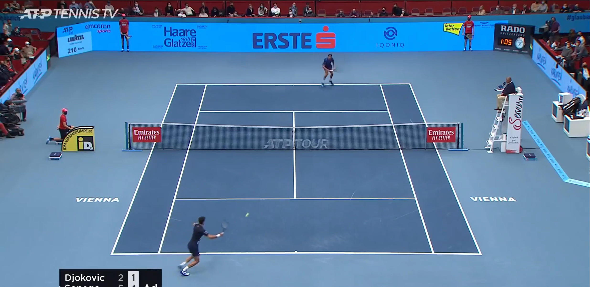
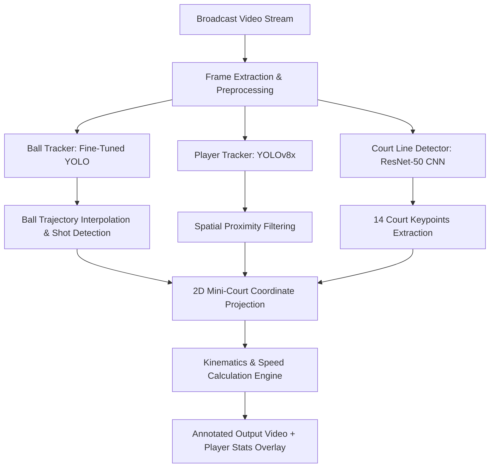

<div align="center">

# 🎾 V-PLAY — AI-Powered Tennis Analytics & Performance Tracking

[](https://www.python.org/)
[](https://pytorch.org/)
[](https://github.com/ultralytics/ultralytics)
[](https://opencv.org/)
[](LICENSE)

<p align="center">
  <b>Real-Time Computer Vision Pipeline for Player Tracking, Ball Trajectory Estimation, Court Keypoint Detection, and 2D Tactical Minimap Kinematics</b>
</p>

---



</div>

---

## 📌 Project Overview

**V-PLAY** is an end-to-end computer vision and deep learning sports analytics system designed to automate match performance analysis from raw broadcast video footage. 

By combining object detection (**YOLOv8**), small-object trajectory tracking with linear interpolation, convolutional keypoint regression (**ResNet-50**), and perspective coordinate transformations, **V-PLAY** extracts real-time kinematic metrics including:
- **Ball shot speed (km/h)**
- **Player movement velocity & court distance covered**
- **Total shot counts per rally**
- **2D Top-Down Mini-Court Tactical Projection**

---

## 🏛️ System Architecture & Pipeline



---

## ⚙️ Core Technical Modules

### 1. 🏃 Player Detection & Tracking (`trackers/player_tracker.py`)
- Employs **YOLOv8x** for bounding box detection of players across video frames.
- Implements spatial proximity heuristics using court boundary keypoints to filter out spectators, referees, and background individuals, isolating only the active players on court.

### 2. 🎾 High-Speed Ball Tracking & Interpolation (`trackers/ball_tracker.py`)
- Detects fast-moving tennis balls using a fine-tuned custom YOLO detector.
- Solves camera motion blur and temporary ball occlusions by applying **Pandas-based linear interpolation** across consecutive frames to maintain smooth, continuous trajectory vectors.
- Automatically calculates **Ball Hit Frames** by detecting trajectory inflection points.

### 3. 📐 Court Keypoint Estimation (`court_line_detector/`)
- Utilizes a modified **ResNet-50** CNN architecture with a custom regression head predicting **14 geometric keypoints** (corners, service lines, baseline vertices).
- Transforms arbitrary broadcast camera angles into calibrated geometric reference markers.

### 4. 🗺️ 2D Mini-Court Homography Projection (`mini_court/`)
- Projects detected pixel bounding boxes into a standardized 2D top-down mini-court coordinate system.
- Converts raw pixel displacements into real-world metric distances (meters) using official ITF court regulation dimensions (`DOUBLE_LINE_WIDTH = 10.97m`).

### 5. ⚡ Match Kinematics & Statistics Engine (`main.py`)
- **Ball Shot Speed**: Calculated from mini-court spatial displacement over elapsed frame duration ($\text{km/h} = \frac{\Delta d_{\text{meters}}}{\Delta t_{\text{seconds}}} \times 3.6$).
- **Player Speed & Distance**: Measures opponent reaction and transition speed per shot exchange.
- **Dynamic Stats HUD**: Overlays real-time performance scoreboards on video output.

---

## 📂 Repository Structure

```text
V-PLAY/
│
├── court_line_detector/           # ResNet-50 keypoint regression model & utilities
│   ├── court_line_detector.py
│   └── __init__.py
│
├── trackers/                      # Detection & tracking pipelines
│   ├── player_tracker.py          # YOLOv8 player tracking & court filtering
│   ├── ball_tracker.py            # Ball detection, interpolation & hit detection
│   └── racket_tracker.py          # Racket detection modules
│
├── mini_court/                    # 2D top-down perspective conversion
│   ├── mini_court.py              # Pixel-to-meter transformation logic
│   └── __init__.py
│
├── tracker_stubs/                 # Pre-computed detection caches for fast debugging
├── Input_video/                   # Sample test footage & visual assets
│   ├── input_video.mp4
│   └── image.png
│
├── utils/                         # Video I/O, geometric math & overlay helpers
├── constants/                     # Court dimension constants & measurement scalars
├── training/                      # Model training scripts, configs & datasets
├── main.py                        # Central pipeline orchestration script
├── yolo_inference.py              # YOLO inference test sandbox
└── README.md                      # Project documentation
```

---

## 📊 Sample Metrics & Analytics Output

| Metric | Calculation Method | Use Case |
| :--- | :--- | :--- |
| **Ball Shot Speed** | $\frac{\Delta d_{\text{mini-court}}}{\text{Frames} / 24\text{ FPS}} \times 3.6$ | Serve/Return power assessment |
| **Player Speed** | Real-time opponent displacement tracking | Court coverage & reaction time |
| **Shot Count** | Trajectory directional inflection detection | Rally length & shot frequency |
| **Mini-Court Map** | Perspective homography projection | Tactical positioning & heatmap basis |

---

## 🚀 Getting Started

### 1. Prerequisites
Ensure you have **Python 3.8+** installed with PyTorch and CUDA (optional for GPU acceleration):

```bash
git clone https://github.com/code-with-apoorv/V-PLAY.git
cd V-PLAY
```

### 2. Install Dependencies
```bash
pip install ultralytics torch torchvision opencv-python pandas numpy
```

### 3. Run Analysis Pipeline
Place your target video inside `Input_video/` and execute:
```bash
python main.py
```

The system will process each frame, run YOLOv8 tracking, project player positions onto the tactical mini-court, compute kinematics, and generate the annotated video output.

---

## 🔮 Future Enhancements & Final-Year Extensions

- [ ] **Pose Estimation (YOLOv8-Pose)**: Classify shot types (Forehand, Backhand, Smash, Serve).
- [ ] **Player Court Heatmaps**: Generate 2D density maps illustrating court coverage efficiency.
- [ ] **In/Out Line Calling System**: Automate Hawkeye-style line boundary decisions using keypoint geometry.
- [ ] **Real-Time Stream Support**: Multi-threading optimizations with TensorRT for live match streaming.

---

## 👨‍💻 Author
**Apoorv**  
- GitHub: [@code-with-apoorv](https://github.com/code-with-apoorv)  
- Repository: [V-PLAY on GitHub](https://github.com/code-with-apoorv/V-PLAY)
